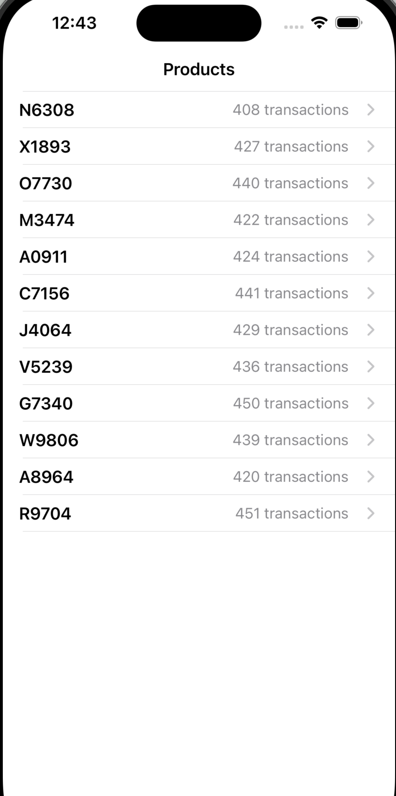
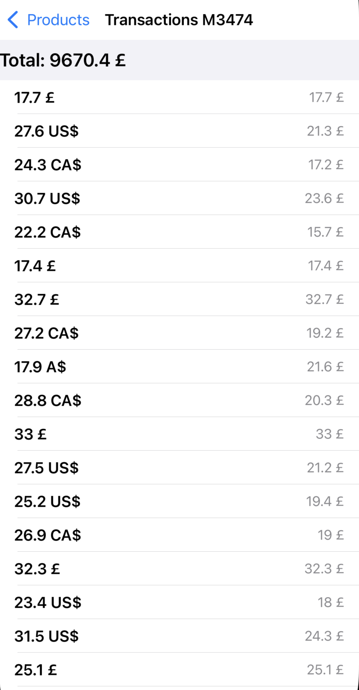

# TransactionsViewer

**TransactionsViewer** is a UIKit-based iOS application that loads financial transactions from a local plist file and presents them in a structured list.

The project focuses on clean data parsing, separation of concerns, and a maintainable UIKit architecture.

## Features
- Load and parse transactions from a local plist file
- Map raw data into domain models
- Display transactions using a UITableView
- Modular architecture with clear responsibility boundaries
- Unit tests for core business logic

## Screenshots

<table>
  <tr>
    <td align="center">
       
      <b>Transactions list</b>
    </td>
    <td align="center">
       
      <b>Transaction details</b>
    </td>
  </tr>
</table>

## Architecture
The app follows a modular UIKit architecture with explicit separation between:
- Presentation layer (View / ViewController)
- Business logic (Presenter / Services)
- Data access layer (local plist source)

This structure keeps the codebase testable and easy to evolve.

## Tech Stack
- Swift
- UIKit
- Auto Layout
- XCTest
- SwiftLint / SwiftFormat

## Requirements
- iOS 15+
- Xcode 15+

## Project Goals
This project was created to demonstrate practical iOS development skills, including data parsing, UI composition, and code organization, rather than to serve as a production banking app.
